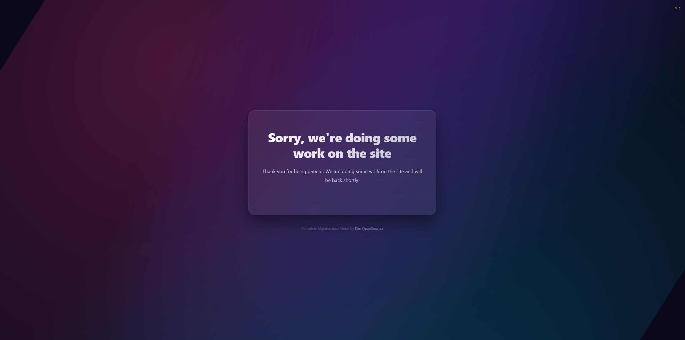
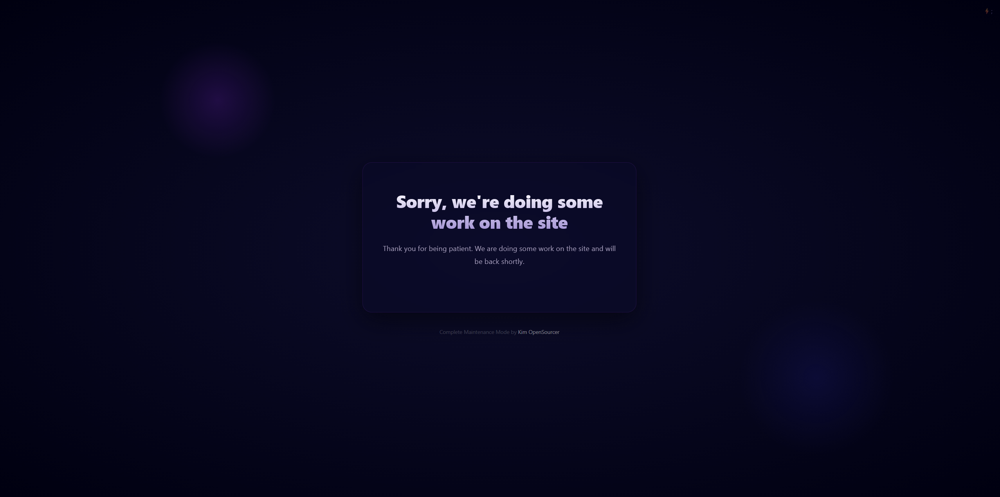
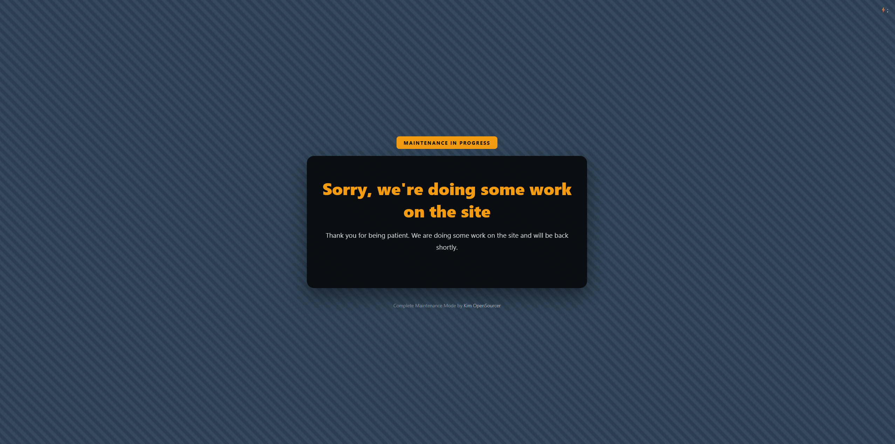
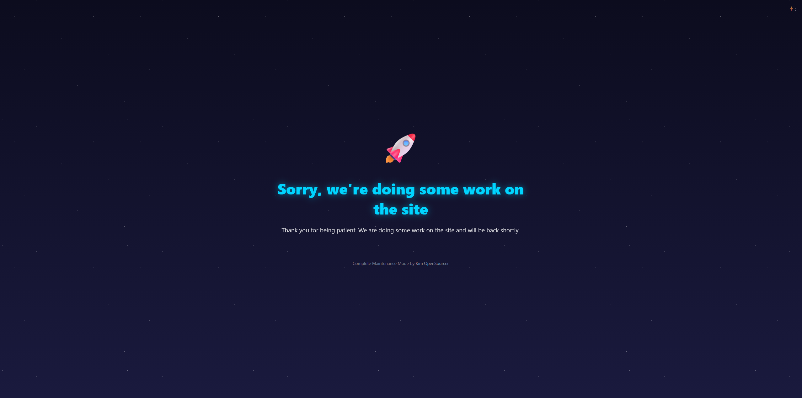

# Complete Maintenance Mode

A complete maintenance and under construction mode plugin for WordPress with full customization. All features included right out of the box.

## Features

- **10 Built-in Themes** — Gradient Mesh, Cosmos, Zen, Emerald, Neon Glow, Light, Construction, Rocket, Dark Minimal, Clock Timer
- **Full Customization** — title, heading, body text, meta description, custom CSS
- **Social Media Links** — Facebook, Twitter/X, Instagram, YouTube, Telegram, LinkedIn, Email and more
- **Access Control** — whitelist specific user roles and individual users
- **Auto-Disable** — schedule maintenance mode to turn off automatically
- **SEO Friendly** — proper 503 status code, Retry-After header, noindex meta tag
- **Google Analytics 4** — track visitors even while in maintenance mode
- **Admin Bar Controls** — toggle maintenance mode, preview, and access settings from anywhere
- **Login Button** — optional login link on the maintenance page
- **Multisite Compatible**

## Installation

1. Upload the plugin files to the `/wp-content/plugins/complete-maintenance-mode` directory, or install the plugin through the WordPress plugins screen directly.
2. Activate the plugin through the 'Plugins' screen in WordPress.
3. Go to **Settings > Complete Maintenance Mode** to configure.
4. Enable maintenance mode from the admin bar or settings page.

## Requirements

- WordPress 5.0 or higher
- PHP 7.0 or higher

## License

This plugin is licensed under the GPLv2 or later license.

https://www.gnu.org/licenses/gpl-2.0.html

## Author

Kim OpenSourcer — https://profiles.wordpress.org/kimopensourcer

## Screenshots

### 1. Gradient Mesh Theme

Modern gradient mesh design with a clean, professional look.

### 2. Cosmos Theme

Space-inspired dark theme with floating particles and a cosmic feel.

### 3. Construction Theme

Industrial construction theme perfect for sites under heavy development.

### 4. Rocket Launch Theme

Dynamic rocket animation theme for sites launching soon.
